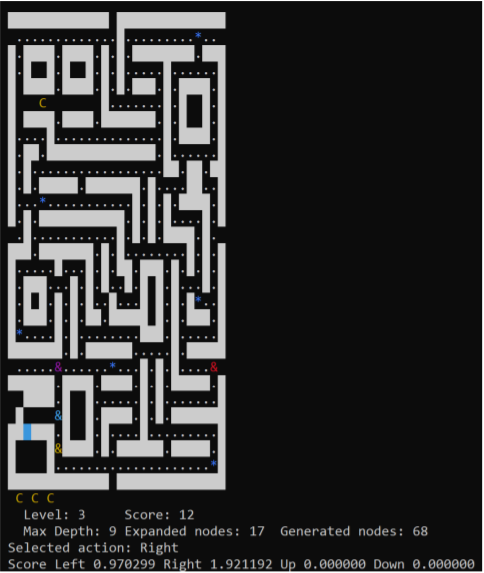

# pacman-ai-agent-
A practice of breadth-first algorithms ( Dijkstra algorithms) 
## Introduciton
In this project, I will build a AI agent using Dikjstra algorithms to play play Pac-Man game and try to achieve the highest score.

## Implementation
The code for Pac-Man was adapted from the open-source made available by [Mike Billars](https://sites.google.com/site/doctormike/pacman.html) and the original version can be installed as a standard package in [Ubuntu](https://packages.ubuntu.com/xenial/games/pacman4console).

### How Pac-Man game works
For the explaination, see [Pacman Wikipedia](https://en.wikipedia.org/wiki/Pac-Man)

### AI agent

The Pac-Man Graph G = {V, E} is implicitly defined. The vertex set V is defined as all the possible configurations (states),
and the edges E connecting two vertexes are defined by the legal movements (right, left, up, down).

The AI agent will use Dijkstra algorithms to find the most rewarding path for pre defined maximum budget of the explored nodes.
For every step, explore all the posible path until consumming the budget if possible, find the highest vertex and return the first action only and execute that move. If having the same highest score, they will be broken randomly.

The algorithms should following these step:

**Reward of a step is caclulated by `r(n) = (h(n) + score(n) − score(nParent)) * pow(discountFactor, depth)`**
* h(n): The heuristic function is h(n) = i − l − g, where i = 10 if Pac-Man has eaten a fruit and becomes invincible in that state; l = 10 if a life has been lost in that state; and g = 100 if the game is over. Otherwise i = l = g = 0.
* score(n) − score(nParent): The change in score between the current node and the parent node.

**The predicted score of each movement will be calculated using all of the r-values of the movement node and its children. There are two ways to do this:**
* max: adds up all of the rewards, stops when a move leads to a life lost.
* avg: compute the average of the rewards, that is, the total reward divided by the number of the movement node's children.

